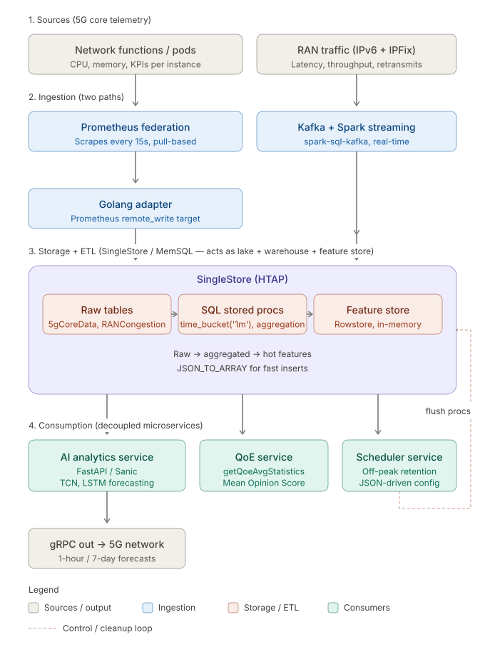

Here is the end-to-end data engineering lifecycle for the NWDAF platform, detailing how data moved from raw collection to being served by microservices.

### **1. Data Collection & Streaming (Prometheus, Kafka, & Spark)**
The lifecycle begins with high-velocity telemetry data, such as IPv6 packets and network function statistics, generated by millions of subscribers. 
*   **Prometheus Federation:** A master Prometheus server continuously scrapes system and KPI data (like CPU usage, memory, throughput, and latency) from various microservices and namespaces every 15 seconds.
*   **Streaming Pipeline:** To handle the massive scale and prevent data ingestion bottlenecks, the architecture uses **Kafka** combined with **Spark connectors** (`spark-sql-kafka`). This streaming setup replaces slower batch processing, allowing the system to ingest and process raw data in real-time.

### **2. Data Ingestion (Golang Adapter & MemSQL)**
Once the data is collected, it needs to be reliably loaded into the database.
*   **Data Ingestion Service:** Prometheus uses a "remote write" configuration to push data in chunks to a dedicated **Golang microservice**.
*   This ingestion service acts as an adapter, processing the incoming Prometheus metrics and inserting the raw data directly into the **SingleStore (MemSQL)** database. 

### **3. Data Storage & ETL Processing (SQL in SingleStore)**
Within SingleStore, data undergoes heavy ETL (Extract, Transform, Load) processing using SQL to prepare it for machine learning and analytics.
*   **Raw Data Storage:** The incoming data is stored as-is in raw tables like `5gCoreDataCounterdata` and `RANCongestionRAWData`. 
*   **SQL Aggregation & Time-Bucket:** Complex SQL stored procedures aggregate the raw data. For example, queries use `time_bucket('1m', IPFixRecTs)` to group high-frequency packet data into 1-minute intervals, calculating the average latency, throughput, and retransmission rates. 
*   **Feature Store (RowStore):** To achieve low-latency predictions, you created an **"Online Store" or Feature Store** using MemSQL **Rowstore** tables (e.g., `RANonlinestore` or `RANtestonlinestore`). While this sacrificed some storage efficiency compared to disk-based ColumnStores, it kept the most critical data hot in memory for immediate read access. You utilized functions like `JSON_TO_ARRAY` to rapidly insert preprocessed arrays into these tables.

### **4. Consumption by Microservices**
Once the data is processed and stored in SingleStore, it is consumed by various decoupled microservices to drive network intelligence.
*   **AI Analytics Service (FastAPI/Sanic):** This inference engine queries the MemSQL Feature Store to fetch exactly the last 60 timestamps of data for a specific location or instance. It feeds this 60-timestamp sequence into deployed AI models (like TCN or LSTM) to generate 1-hour or 7-day forecasts. The results are served back to the network via high-speed **gRPC** APIs.
*   **QoE (Quality of Experience) Service:** This service utilizes complex custom SQL functions like `getQoeAvgStatistics` to dynamically calculate the Mean Opinion Score (MOS) directly from the `RANCongestionRAWData` table based on real-time throughput, latency, and packet retransmission.
*   **Scheduler Service:** To prevent the database from growing infinitely and crashing, a dedicated scheduler microservice reads JSON configurations to determine "busy hours". During off-peak times, it triggers stored SQL procedures (like `nfload_rawdata_flush` and `RAN_CellIdentifierAgg_flush`) to safely delete and flush expired data from the MemSQL tables based on retention policies.


What is the data wareshouse/data lake?


In the NWDAF architecture, there is no explicit mention of a standalone "data lake" (like AWS S3) or a separate "data warehouse" (like Snowflake). Instead, the platform relies on **SingleStore (MemSQL)** as a unified, high-performance database that effectively serves the functions of both.

Here is how SingleStore handles these responsibilities within your data engineering lifecycle:

**1. Acting as a Data Lake (Raw Data Ingestion)**
SingleStore is the primary destination for the massive volumes of raw, high-velocity telemetry data continuously streaming in from the network. A Golang data ingestion service acts as an adapter, receiving chunks of metrics from Prometheus and inserting them directly into SingleStore. The database contains specific tables, such as `5gCoreDataCounterdata` and `RANCongestionRAWData`, which store this raw data exactly as it is received from the network functions, mirroring the raw storage concept of a data lake.

**2. Acting as a Data Warehouse and Feature Store (Analytics Processing)**
Once the raw data is stored, SingleStore is heavily utilized for ETL (Extract, Transform, Load) operations to structure and prepare the data for downstream analytics and machine learning.
*   **Data Aggregation:** The system runs complex SQL stored procedures to process the raw data. For example, queries utilize `time_bucket('1m', IPFixRecTs)` to aggregate high-frequency IPv6 packet data into 1-minute intervals, calculating averages for network latency, throughput, and retransmission rates.
*   **In-Memory Feature Store:** To meet the strict low-latency requirements for real-time model predictions, you configured SingleStore to use **in-memory RowStore** tables (such as `RANonlinestore` or `RANtestonlinestore`). While this sacrifices some of the storage efficiency typical of disk-based ColumnStores, it acts as a highly optimized Feature Store that keeps the most critical, processed data hot in memory for instant retrieval by the AI inference engine.

**3. Data Retention Management**
Because storing raw telemetry data for millions of subscribers would eventually overwhelm the system, the platform does not store historical data indefinitely like a traditional long-term data lake. Instead, you built a dedicated scheduler microservice that executes automated batch cleanups (e.g., `nfload_rawdata_flush`) during off-peak network hours to safely delete expired data based on configured retention policies (e.g., older than 48 hours).


How did the scheduler microservice prevent database crashes during peaks?


The scheduler microservice prevented database crashes by proactively managing data retention so the MemSQL database did not grow infinitely and become overwhelmed. It accomplished this through the following mechanisms:

*   **Tracking Peak Traffic:** The scheduler read JSON configuration files to explicitly define network "busy hours" (e.g., peak times starting at 6 and ending at 11).
*   **Off-Peak Execution:** By identifying these peak periods, the microservice ensured that heavy database cleanup and deletion tasks were executed strictly during off-peak times, preventing database locks or resource starvation when the network was handling maximum live traffic.
*   **Automated Data Flushing:** During the off-peak windows, the scheduler spawned threads to trigger specific stored SQL procedures, such as `nfload_rawdata_flush` and `RAN_CellIdentifierAgg_flush`.
*   **Enforcing Retention Policies:** These stored procedures calculated a threshold timestamp based on a configured retention period (e.g., 48 hours) and safely deleted any expired telemetry data older than that limit (e.g., `DELETE FROM 5gCoreDataCounterdata WHERE countertimestamp < threshold_ts`).


What is the data ingestion/the data regarding. What is the usecase that data is collected for and from where it is collected. APIs logs, iot devices??

The data ingested by the NWDAF (Network Data Analytics Function) system is not from standard API logs or IoT devices; rather, it consists of high-velocity **5G network telemetry data** generated by millions of subscribers and internal network infrastructure. 

The data collection is driven by two primary predictive use cases:

**1. Network Function (NF) Load**
*   **What the data is:** This data monitors the health and hardware utilization of specific 5G network functions (such as the Session Management Function, or SMF). It specifically tracks metrics like **CPU load, memory load, and disk usage** per instance.
*   **Where it comes from:** It is collected directly from the various namespaces, pods, and microservices running within the deployment cluster.
*   **How it is collected:** A monitoring layer (MTCIL) uses **Prometheus** to continuously scrape these system metrics from each namespace. Prometheus then uses a "remote write" configuration to push this data in chunks to a dedicated **Golang data ingestion microservice**. This microservice acts as an adapter, processing the incoming Prometheus metrics and inserting the raw data directly into the MemSQL database.

**2. RAN (Radio Access Network) Congestion & Quality of Experience (QoE)**
*   **What the data is:** This data tracks the actual flow of traffic across the network cells to detect congestion and predict the end-user's Quality of Experience. The core metrics include **network latency, throughput, packet retransmission rates, and the number of active flows**. 
*   **Where it comes from:** This data comes from **raw IPv6 packets** and IPFix (IP Flow Information Export) records sent by external network sources. 
*   **How it is collected:** Because this data arrives at a massive scale, the system uses a streaming pipeline built with **Kafka and Spark connectors** (`spark-sql-kafka`) to ingest the raw packet data in real-time, effectively replacing slower batch processing methods. 

In summary, the ingested data is carrier-grade 5G network telemetry—ranging from internal hardware metrics scraped by Prometheus to raw IPv6 network traffic streamed via Kafka.




**Q. Why Kafka and Spark for the streaming path?**
This is the **architecture decision** question — interviewers want to hear you reason about *why this combination* over the alternatives, not just describe what Kafka and Spark do. Frame it as a pair of independent choices: Kafka for the transport, Spark for the processing.

## Why Kafka for transport

**1. Producer/consumer decoupling.** The UPF and IPFix exporters produce data continuously at line rate. SingleStore writes are slower and have variable latency. Without a buffer between them, any DB slowdown — a long query, a flush procedure, a brief network hiccup — would back-pressure all the way to the UPF. With Kafka in the middle, the UPF just writes to a topic and forgets; the consumer reads at its own pace. The producer never sees the consumer's problems.

**2. Durable replay.** Kafka holds data for a configurable retention window (typically days). If the Spark job crashes, has a bug, or the SingleStore write fails, you reset the consumer offset and reprocess. Without Kafka, packets dropped during an outage are gone forever — and in a carrier system, "gone forever" means your AI model has a blind spot it never recovers from.

**3. Horizontal scale through partitioning.** Kafka topics are split into partitions. You can partition by cell ID, by region, or by subscriber hash, and consume each partition with a different Spark task in parallel. When subscriber count doubles, you add partitions and consumers — no rewrite. This is the only way to absorb 5G-scale event volumes economically.

**4. Multiple independent consumers.** The same IPFix stream can be consumed by Spark Streaming for the feature pipeline, by a separate fraud-detection job, by a real-time dashboard, by an audit/compliance log — all reading from the same topic with their own offsets, none affecting the others. With a point-to-point pipe (UPF → Spark → SingleStore), any new use case requires re-instrumenting the source.

**5. Backpressure absorption during traffic spikes.** Network traffic is bursty — Black Friday, sports events, regional disasters all cause 5–10× spikes. Kafka's disk-based log absorbs these without dropping data; downstream consumers catch up after the spike. A direct-write pipeline would have to be over-provisioned 10× to handle peaks, wasting money the rest of the time.

### Alternatives to Kafka and why they lose

| Alternative | Why it didn't fit |
|---|---|
| **RabbitMQ** | Smart broker (routing, queues, ACKs), not a log. Great for task distribution, terrible for replay and high-throughput streaming. Single-digit MB/sec per node vs. Kafka's hundreds. |
| **AWS Kinesis** | Functionally similar to Kafka, but cloud-locked. Mavenir is an on-prem telecom vendor — most deployments are in customer data centers. |
| **NATS / Pulsar** | Pulsar is a legitimate alternative (tiered storage, multi-tenant), but in 2020-2023 the operational maturity, tooling, and engineering familiarity were heavily Kafka-favored. |
| **Direct UPF → SingleStore** | No buffer, no replay, no backpressure handling, no multi-consumer support. One DB hiccup propagates upstream. |
| **HTTP push / REST endpoints** | Synchronous — couples producer to consumer latency. Per-request overhead murders throughput at packet scale. |

## Why Spark Structured Streaming for processing

**1. Native Kafka integration via `spark-sql-kafka`.** First-class connector — checkpointing, offset management, exactly-once semantics with idempotent sinks all built in. You don't write that plumbing yourself.

**2. SQL-like API on streams.** The same SELECT, GROUP BY, window aggregation syntax you use on a static table works on a stream. Engineers who know SQL can write streaming jobs without learning a new programming model. This matters more than it sounds — it widens your hiring pool and reduces bugs.

**3. Windowed aggregations.** IPFix records arrive continuously, but the feature store needs *per-minute* aggregates for the AI models. Spark's window functions — `window(timestamp, '1 minute')` — handle the bucketing, late-arriving event reordering, and watermarking automatically. Doing this by hand in custom code is where streaming pipelines go to die.

**4. Unified batch + streaming code.** The same Spark code can run on historical data (backfill) or live streams. When you fix a bug in your transformation logic, you re-run it on Kafka history and the new logic re-derives the feature store. That's the Kappa architecture pattern, and Spark Structured Streaming is built for it.

**5. JVM and ecosystem maturity.** Spark runs on the JVM, has years of production hardening at scale, integrates with virtually every storage system, and has well-known operational characteristics. For a carrier-grade system, "boring and battle-tested" is a feature, not a weakness.

**6. Connector to SingleStore.** SingleStore has an official Spark connector for both reads and writes, with parallel partition-aware writes. Spark already speaks SingleStore's wire protocol efficiently — you're not reinventing the integration layer.

### Alternatives to Spark and the honest trade-offs

| Alternative | Trade-off |
|---|---|
| **Apache Flink** | Genuinely better for sub-second latency and complex stateful processing — true event-at-a-time vs. Spark's micro-batch. The honest answer in interviews: "If we were building this fresh today, Flink would be on the table. We chose Spark because the team had deep Spark experience and our SLA was minutes, not milliseconds — micro-batch was acceptable." |
| **Kafka Streams** | Lightweight, no separate cluster needed, runs as a library inside your app. Great for simple per-event transforms. Loses to Spark when you need joins across topics, large aggregations, or non-JVM language support. Not viable when transformations are complex. |
| **Apache Beam (on Dataflow/Flink)** | Portable across runners — write once, run on Flink, Spark, or Dataflow. Heavyweight; overkill unless you genuinely need the portability. |
| **Custom Go consumers** | The Go adapter pattern works for the metrics path because the transformation is trivial (parse Prometheus protobuf, INSERT). For windowed aggregation across millions of flows, you'd rebuild Spark badly. |
| **ksqlDB** | SQL on Kafka, no separate compute layer. Lightweight, but limited to what the Kafka Streams engine can do. Doesn't scale to the join and aggregation complexity needed here. |

## Why this specific combination — the system-level argument

The deeper answer interviewers reward: **Kafka and Spark were chosen as a pair because their failure modes complement each other.**

- Kafka guarantees **durability and ordering within a partition**.
- Spark guarantees **exactly-once processing semantics** when paired with a transactional or idempotent sink.
- Together: an IPFix record entering Kafka will be processed exactly once into SingleStore, even across Spark restarts, network partitions, or partial failures.

If you swap either component, you lose this property. Kafka without Spark loses the windowed aggregation guarantees. Spark without Kafka loses the replay-after-failure guarantee. You'd have to reimplement what the other side gave you for free.

## The 60-second interview answer

> "Two separate decisions. Kafka for transport because we needed producer-consumer decoupling, durable replay if a downstream job failed, partitioned parallelism to handle 5G-scale flow volumes, and backpressure absorption during traffic spikes — IPFix can burst 10× during peak events, and direct writes to SingleStore would have caused upstream packet loss at the UPF. Spark Structured Streaming for processing because we needed windowed per-minute aggregations on millions of flows with watermarking for late events, native Kafka and SingleStore connectors so we weren't writing integration plumbing, and the SQL-like API meant engineers familiar with batch SQL could write streaming jobs. Together they give exactly-once processing semantics — Kafka guarantees durable ordering, Spark plus an idempotent sink guarantees no double-writes. The honest trade-off: if we were starting fresh today and the SLA dropped to sub-second, Flink would be the better processing choice. Spark was right for our minute-level SLA and the team's existing skill set."

That last sentence — admitting where the choice was constrained by team skill and acknowledging Flink as a credible alternative — is exactly the kind of trade-off honesty senior interviewers score highly. Don't oversell your stack; show you knew the alternatives and picked deliberately.


**Q. What does the Golang adapter actually do with remote_write?**

Excellent — this is a **deep systems** question. Interviewers asking about `remote_write` are probing whether you understand the protocol layer, not just the architecture diagram. Here's what the adapter actually does, byte by byte.

## What `remote_write` is at the protocol level

Prometheus's `remote_write` is a wire protocol defined by Prometheus, not an HTTP endpoint you design. The contract is fixed:

- **Transport:** HTTP POST
- **Encoding:** Protobuf payload, Snappy-compressed
- **Schema:** A `WriteRequest` message containing a list of `TimeSeries`, each with labels and samples
- **Headers:** `Content-Encoding: snappy`, `Content-Type: application/x-protobuf`, `X-Prometheus-Remote-Write-Version: 0.1.0`

The Prometheus master is configured with something like:

```yaml
remote_write:
  - url: "http://golang-adapter.nwdaf.svc:9090/write"
    queue_config:
      capacity: 10000
      max_samples_per_send: 2000
```

Prometheus batches scraped samples in memory, compresses them, and POSTs to that URL every few seconds. Your Go adapter is what listens on the other end.

## The adapter's job, end to end

It's an **HTTP server that translates one protocol into another** — Prometheus's protobuf wire format into SingleStore's SQL INSERT statements. Five concrete steps:

### 1. Receive and decompress

```go
http.HandleFunc("/write", handleRemoteWrite)
```

The handler reads the POST body, which is Snappy-compressed Protobuf. First step: decompress.

```go
compressed, err := io.ReadAll(r.Body)
decompressed, err := snappy.Decode(nil, compressed)
```

If you skip Snappy decoding, Protobuf parse fails immediately because the magic bytes are wrong. This is the #1 source of bugs in custom adapters.

### 2. Unmarshal into the WriteRequest struct

The Prometheus team publishes the Protobuf schema (`prompb.WriteRequest`). You import the generated Go bindings:

```go
var req prompb.WriteRequest
err := proto.Unmarshal(decompressed, &req)
```

After this you have a Go struct: a slice of time series, each with `Labels []Label` and `Samples []Sample`. A single request might contain 2,000+ samples spread across hundreds of unique label combinations.

### 3. Translate Prometheus's label model to SingleStore's relational model

This is the **hardest part conceptually**. Prometheus models data as `(metric_name, {label1=val1, label2=val2, ...}, timestamp, value)`. SingleStore wants rows in tables with fixed columns.

A Prometheus sample looks like:

```
node_cpu_usage{namespace="smf-prod", pod="smf-7d9f", instance="10.0.1.5"} 0.84 @1730543812000
```

You need to decide: does this become a row in `nfload_rawdata` with columns `(metric_name, namespace, pod, instance, ts, value)`? Or do you have a wide table per metric? Or a single tall table with a JSON labels column?

The NWDAF approach (based on your project doc) was a **purpose-built schema per metric family** — `5gCoreDataCounterdata`, `RANCongestionRAWData`, etc. The adapter inspects the metric name and routes the sample to the right table. Something like:

```go
for _, ts := range req.Timeseries {
    metricName := getLabel(ts.Labels, "__name__")
    table := routeToTable(metricName)  // maps metric → target table
    for _, sample := range ts.Samples {
        rows[table] = append(rows[table], buildRow(ts.Labels, sample))
    }
}
```

### 4. Batch and bulk-insert into SingleStore

Per-row INSERTs would crater throughput. The adapter batches samples per table, then uses one of three strategies:

- **Multi-row INSERTs** — `INSERT INTO t (a,b,c) VALUES (...), (...), (...)` with hundreds of tuples per statement.
- **`LOAD DATA` from in-memory pipe** — fastest path SingleStore offers, equivalent to bulk-load mode.
- **Prepared statements with batched parameter sets** — cleaner code, slightly slower than `LOAD DATA`.

The adapter holds an open connection pool to SingleStore (typically `database/sql` with a tuned `MaxOpenConns`) so you're not paying TCP/auth handshake cost on every request.

### 5. Acknowledge — or refuse — the request

This is where most homegrown adapters get subtly wrong. The Prometheus contract:

- Return **HTTP 200** → Prometheus deletes the batch from its WAL
- Return **HTTP 5xx** → Prometheus retries with exponential backoff, samples stay in WAL
- Return **HTTP 4xx (except 429)** → Prometheus drops the batch permanently — bad request, no retry

So if SingleStore is temporarily unavailable, you must return 5xx, **never** 200. Returning 200 on a failed write is data loss. Returning 4xx on a transient error is also data loss. The adapter's error handling is the at-least-once guarantee for the entire pipeline.

```go
if err := db.WriteBatch(ctx, rows); err != nil {
    if isTransient(err) {
        http.Error(w, "db unavailable", http.StatusServiceUnavailable) // 503 → retry
        return
    }
    http.Error(w, "schema mismatch", http.StatusBadRequest) // 400 → drop, alert
    return
}
w.WriteHeader(http.StatusOK)
```

## What it has to handle that's non-obvious

These are the things a senior interviewer probes for after the basic explanation:

**Idempotency.** Prometheus retries on 5xx. If the adapter wrote 1,500 of 2,000 samples and then crashed, the retry will redeliver all 2,000. The adapter must either use idempotent inserts (primary key on `(timestamp, label_hash)` with `ON DUPLICATE KEY IGNORE`) or accept duplicate rows and dedupe at query time. NWDAF chose idempotent inserts because the time-bucket aggregations are sensitive to double-counting.

**Backpressure to Prometheus.** If SingleStore writes slow down, the adapter should respond 503 *before* its own memory fills with queued requests. Otherwise the adapter OOMs and Prometheus's WAL backs up. Implementing a bounded request queue with reject-on-full is essential.

**Cardinality explosion.** A misbehaving exporter can emit metrics with unbounded label values (request IDs, timestamps, raw user input). Each new label combination is a new time series, and the adapter creating new SingleStore rows for each one can balloon the database. The adapter should validate label cardinality and reject or aggregate suspiciously high-cardinality metrics.

**Timestamp handling.** Prometheus samples carry millisecond Unix timestamps. SingleStore's `DATETIME(6)` wants microsecond precision. Conversion errors here cause silent off-by-1000 bugs in time-series queries — interviewers love this trap.

**Connection pool tuning.** Too few connections → adapter blocks on DB I/O, returns 503 unnecessarily. Too many → SingleStore exhausts its connection limit, all writes start failing. NWDAF likely tuned this empirically per cluster size.

**Graceful shutdown.** When the adapter pod is terminated, in-flight requests must finish writing and ack before the process exits, otherwise samples are lost. Standard `signal.NotifyContext` + drain pattern.

## Why Go specifically — the interviewer follow-up

You'll get asked "why Go for this and not Python or Java?" Three real reasons:

**1. Predictable latency.** Go's GC has consistent sub-millisecond pauses. Python's GIL serializes I/O and Java's GC can cause 100ms+ pauses that translate directly into 503s back to Prometheus. For an adapter handling thousands of writes/sec, predictability matters more than peak throughput.

**2. Native protobuf and Snappy support.** Both libraries are first-class in Go (Google maintains them), well-optimized, no runtime quirks. Same in Java but with much heavier deployment artifacts.

**3. Tiny binary, fast startup, minimal container image.** A statically-linked Go binary in a `scratch` or `distroless` container is ~15MB, starts in milliseconds, has a small attack surface. For a sidecar-style microservice you deploy across many namespaces, this matters.

The honest counterpoint: Java would give you the official Prometheus Java client and possibly slightly better throughput at the cost of memory footprint. Rust would give you memory safety and equal performance. Go was the pragmatic middle.

## Why a custom adapter at all — the deepest follow-up

The big "why not buy" question: Prometheus already has remote-write integrations for InfluxDB, M3DB, VictoriaMetrics, Cortex, Thanos, and others. Why write a custom adapter for SingleStore?

The answer NWDAF used: **none of the off-the-shelf TSDBs would have supported the HTAP feature-store pattern.** You needed the *same* engine that ingests raw data to also serve sub-10ms feature lookups *and* run windowed SQL aggregations. That's SingleStore. None of the standard remote-write targets were SingleStore, so the adapter had to be built. The alternative — Prometheus → InfluxDB → ETL job → SingleStore — would have added 2 hops, 1 storage system to operate, and minutes of pipeline lag.

That's the kind of constraint-driven reasoning interviewers reward: not "Go is cool," but "the storage choice forced the integration choice."

## The 90-second interview answer

> "It's an HTTP server that speaks Prometheus's `remote_write` protocol on the inbound side and SingleStore's SQL on the outbound side. Prometheus POSTs Snappy-compressed Protobuf payloads — usually a `WriteRequest` containing a few thousand samples per request — and the adapter decompresses, unmarshals into Prometheus's TimeSeries struct, then translates from Prometheus's label-based model to our relational schema. Each metric name maps to a target table — NF load metrics to one table, RAN aggregates to another. Samples get batched and bulk-inserted using multi-row INSERTs over a pooled SingleStore connection. The critical part is the response code: 200 only on confirmed write, 503 on transient DB issues so Prometheus retries from its WAL — getting that wrong is silent data loss. We had to handle idempotency on retries with primary keys on timestamp plus a label hash, and bound the in-memory queue to apply backpressure to Prometheus before the adapter itself OOMs. We chose Go over Java because GC pauses are predictable and the binary is tiny — important for a sidecar deployed across many namespaces. We wrote it custom rather than using an existing Prometheus → TSDB integration because none of the standard targets — InfluxDB, M3, Cortex — supported the HTAP feature-store pattern we needed in SingleStore."

That answer hits: protocol depth (Snappy + Protobuf), correctness traps (HTTP status codes, idempotency, backpressure), language justification with trade-offs, and the system-level reason the component exists at all. It's the kind of layered answer that signals you actually built and operated this thing.


**Q What raw tables exist and how are they written?**

Good question — this one tests whether you can describe the **physical schema** and the write path with enough precision to convince an interviewer you actually operated the system. Let me walk through what existed and how data landed in it.

## The two main raw tables

Based on your project doc, there were at least two distinct raw landing tables, each fed by a different ingestion path:

### `5gCoreDataCounterdata`

The destination for **Prometheus-path metrics** — system health and 5G NF KPIs scraped by Prometheus federation, translated by the Go adapter, and inserted into this table.

A schema for this kind of table typically looks like:

```sql
CREATE TABLE 5gCoreDataCounterdata (
    countertimestamp DATETIME(6) NOT NULL,
    namespace        VARCHAR(64),
    podname          VARCHAR(128),
    instance_id      VARCHAR(64),
    nf_type          VARCHAR(32),    -- 'SMF', 'AMF', 'UPF', etc.
    metric_name      VARCHAR(128),   -- 'cpu_usage', 'session_count'
    metric_value     DOUBLE,
    labels_json      JSON,           -- spillover for high-cardinality labels
    SHARD KEY (instance_id),
    SORT KEY (countertimestamp)
) USING COLUMNSTORE;
```

Key design choices to call out:

- **`countertimestamp` as the primary time dimension** — every retention query keys off this. The scheduler's `nfload_rawdata_flush` deletes rows where `countertimestamp < threshold_ts`.
- **Columnstore engine** — because this table is enormous and queried for aggregations (sums, averages over time windows). Columnar compression on repeated values (namespace, nf_type) gives 10-20× storage savings.
- **`SHARD KEY` on instance_id** — distributes writes across nodes by NF instance, so concurrent writes from many sources don't hot-spot on one partition.
- **`SORT KEY` on countertimestamp** — within a partition, data is physically ordered by time, which makes range scans (the dominant query pattern) extremely fast.

### `RANCongestionRAWData`

The destination for the **Kafka/Spark-path data** — IPFix flow records and IPv6 traffic metrics streamed in real-time. Schema is wider because flow records carry more dimensions:

```sql
CREATE TABLE RANCongestionRAWData (
    IPFixRecTs        DATETIME(6) NOT NULL,
    cell_id           VARCHAR(32),
    src_ip            VARCHAR(45),    -- IPv6 max length
    dst_ip            VARCHAR(45),
    bytes_total       BIGINT,
    packets_total     BIGINT,
    retrans_count     INT,
    avg_latency_ms    DOUBLE,
    throughput_bps    DOUBLE,
    flow_duration_ms  INT,
    qos_flow_id       INT,
    subscriber_hash   VARCHAR(64),    -- privacy-preserving subscriber ID
    SHARD KEY (cell_id),
    SORT KEY (IPFixRecTs)
) USING COLUMNSTORE;
```

Why this shape:

- **`IPFixRecTs` is the IPFix record timestamp** — explicitly named differently from `countertimestamp` so it's clear which path produced the data.
- **Sharded by `cell_id`** — congestion analysis is per-cell, so co-locating a cell's data on one node makes window aggregations local (no cross-node shuffle).
- **Wide schema, no JSON spillover** — IPFix records have a fixed, well-known set of fields, so you can flatten them. Columnstore loves wide tables with predictable schemas.
- **`subscriber_hash` not raw IMSI** — privacy/GDPR-driven. The adapter or Spark job hashes subscriber identifiers before writing.

### Likely supporting tables

Beyond these two main raw tables, NWDAF almost certainly had:

- **`RAN_CellIdentifierAgg`** — referenced by the `RAN_CellIdentifierAgg_flush` stored procedure in your doc. Likely a per-cell rollup table that's also raw-ish (intermediate between raw and feature store).
- **Per-NF-type tables** — `SMFCounterdata`, `UPFCounterdata`, etc. — if the schema differed enough that one wide table got unwieldy.
- **Reference/dimension tables** — cell_id → location, instance_id → NF metadata, used in joins by the QoE service.

## How data is written to each table

The two paths look different at every layer.

### Path 1: Prometheus → Go adapter → `5gCoreDataCounterdata`

The Go adapter receives Snappy-compressed Protobuf, decompresses, parses the WriteRequest, and bulk-inserts. The actual write looks something like:

```sql
INSERT INTO 5gCoreDataCounterdata
  (countertimestamp, namespace, podname, instance_id, nf_type, metric_name, metric_value)
VALUES
  ('2026-05-02 14:23:01.000', 'smf-prod', 'smf-7d9f', '10.0.1.5', 'SMF', 'cpu_usage', 0.84),
  ('2026-05-02 14:23:01.000', 'smf-prod', 'smf-7d9f', '10.0.1.5', 'SMF', 'memory_rss', 2.4e9),
  ('2026-05-02 14:23:01.000', 'amf-prod', 'amf-3a8c', '10.0.2.7', 'AMF', 'cpu_usage', 0.62),
  -- ... up to ~2000 rows per batch
```

A few things worth pointing out:

**Multi-row INSERTs, not row-at-a-time.** The adapter accumulates samples per request and emits one INSERT per batch. Per-row INSERT would cap throughput at ~1K rows/sec; multi-row batched INSERT comfortably handles 100K+ rows/sec into a Columnstore.

**`LOAD DATA` for higher volume.** If the adapter is bottlenecked, the alternative is to stage rows to a memory pipe and use `LOAD DATA LOCAL INFILE` — SingleStore's bulk-load path, which bypasses the SQL parser. This is roughly 5-10× faster than INSERT for large batches.

**Idempotent inserts.** The adapter retries on transient errors (Prometheus's WAL ensures this), so the same sample can arrive twice. Either:

```sql
INSERT IGNORE INTO 5gCoreDataCounterdata ...
```
combined with a unique key on `(countertimestamp, instance_id, metric_name)`, or `ON DUPLICATE KEY UPDATE` if you need to overwrite.

**Connection pooling.** The Go adapter holds a pool of ~20-50 SingleStore connections (`db.SetMaxOpenConns(50)`), reusing them across requests. Each request grabs a connection, runs its batch INSERT, releases. Without pooling, TCP handshake + auth dominates per-request latency.

### Path 2: Kafka → Spark Streaming → `RANCongestionRAWData`

This is a different beast — Spark writes batches in parallel from many executors.

A typical Spark Structured Streaming write looks like:

```python
ipfix_stream = (spark
    .readStream
    .format("kafka")
    .option("subscribe", "ipfix-records")
    .load())

parsed = (ipfix_stream
    .select(from_json(col("value").cast("string"), ipfix_schema).alias("d"))
    .select("d.*"))

(parsed.writeStream
    .format("singlestore")  # or jdbc
    .option("dbtable", "RANCongestionRAWData")
    .option("checkpointLocation", "/checkpoints/ran-raw")
    .trigger(processingTime="30 seconds")
    .outputMode("append")
    .start())
```

What's actually happening on each micro-batch:

**1. Spark consumes a chunk of records from Kafka** — typically 10K-100K records per micro-batch, partitioned by Kafka partition.

**2. Each Spark executor parallel-writes to SingleStore.** The SingleStore Spark connector is partition-aware: each Spark partition writes directly to a SingleStore leaf node, bypassing the aggregator. This is critical for throughput — without it, all writes funnel through one node and become the bottleneck.

**3. Checkpointing in HDFS or S3.** Spark writes the Kafka offsets it has processed to a checkpoint location. If the job crashes, it resumes from the last checkpoint, replaying from Kafka. This is what gives you exactly-once semantics: Kafka offset + idempotent SingleStore write = no data loss, no double-counting.

**4. The trigger interval (30 seconds in this example) controls batching.** Smaller intervals = lower latency but more overhead. Spark's micro-batch model means you're never truly "real-time" — you're "30-second-real-time," which was fine for NWDAF's minute-level aggregations.

### Path 3 (briefly): the aggregation tables

The raw tables aren't the end state. Stored procedures running on a schedule read from `5gCoreDataCounterdata` and `RANCongestionRAWData`, run `time_bucket('1m', ...)` aggregations, and write to intermediate tables. Then another procedure reads those and writes to the Rowstore feature store. So the write paths aren't only ingestion — they include intra-database ETL writes too.

```sql
INSERT INTO RAN_CellIdentifierAgg (cell_id, ts_minute, avg_latency, total_bytes)
SELECT
    cell_id,
    time_bucket('1m', IPFixRecTs) AS ts_minute,
    AVG(avg_latency_ms),
    SUM(bytes_total)
FROM RANCongestionRAWData
WHERE IPFixRecTs >= NOW() - INTERVAL 5 MINUTE
GROUP BY cell_id, ts_minute;
```

## Why this design works — the system-level reasoning

If an interviewer asks "why are these tables structured this way," the answer has three layers:

**1. Columnstore for analytical raw data.** These tables are write-once, read-many for aggregations. Columnstore's compression (often 5-10×) and vectorized scan performance are exactly the right fit. Rowstore for raw would have OOM'd the cluster within hours at 5G volumes.

**2. Time-sorted for retention and range queries.** Both `SORT KEY (timestamp)` and the predictable time-keyed query pattern mean the scheduler's `DELETE WHERE ts < threshold` can prune entire columnar segments without touching individual rows. This is what makes the cleanup scheduler practical at billions-of-rows scale.

**3. Sharded for parallel write throughput.** `SHARD KEY` on a high-cardinality dimension (instance_id, cell_id) means writes from many sources hit different SingleStore leaves simultaneously. Without sharding, the cluster becomes a fancy single-node database.

## Common interview follow-ups

**"How do you handle schema changes in raw tables?"**
SingleStore supports `ALTER TABLE ADD COLUMN` online for Columnstore. The Go adapter and Spark schema both have to be updated to populate the new column, but old rows just have NULL. For breaking changes you create a v2 table and migrate.

**"Why JSON for spillover labels in 5gCoreDataCounterdata but not RANCongestionRAWData?"**
Prometheus metrics have unpredictable labels — different exporters add different ones. IPFix records have a fixed IETF schema. JSON gives flexibility where you need it; flattened columns give performance where you can predict the shape.

**"What's the row count for these tables?"**
At a multi-million-subscriber 5G deployment, `RANCongestionRAWData` could ingest hundreds of thousands of rows per minute — billions per day. `5gCoreDataCounterdata` is smaller, maybe tens of thousands per minute, because it's per-pod not per-flow. Total live row count was bounded only by the retention window (48 hours typical).

**"How do you debug a missing-data issue in a raw table?"**
Three-layer trace: (1) check Prometheus or Kafka for the source data; (2) check the adapter or Spark job logs for write errors; (3) check the SingleStore information schema for the actual rows. Mismatches between layers point to the failing component.

## The 60-second interview answer

> "Two main raw tables. `5gCoreDataCounterdata` for the Prometheus path — a Columnstore table sharded by NF instance ID, sorted by countertimestamp, with metric name, value, namespace, pod, and a JSON labels column for high-cardinality spillover. The Go adapter writes to it via batched multi-row INSERTs over a pooled connection, with idempotent inserts so retries from Prometheus's WAL don't double-count. The second is `RANCongestionRAWData` for the Kafka path — wider fixed schema with cell_id, source/dest IPv6, bytes, packets, retransmits, latency. It's sharded by cell_id so per-cell aggregations stay local. Spark Structured Streaming consumes from Kafka, the SingleStore Spark connector writes partition-aware in parallel directly to leaf nodes, and Kafka offsets are checkpointed for exactly-once semantics. Both tables are Columnstore because we need analytical scans for the aggregation procedures, and both sort by timestamp because retention queries — the scheduler's DELETE WHERE ts < threshold — depend on segment-level pruning to be efficient at billions of rows."

That answer demonstrates schema fluency, write-path knowledge for both ingestion paths, and the system reasoning behind the choices. Three specific things that score points: naming the actual tables from your project, calling out the partition-aware write path for Spark, and connecting the table structure to the retention scheduler's correctness.


**Q How do the SQL stored procedures aggregate data with time_bucket?**


Excellent — this is the **transformation layer** question. Interviewers asking about `time_bucket` are checking three things at once: SQL fluency, understanding of windowed aggregation, and whether you can reason about why this happens in the database instead of upstream. Let me walk through what these procedures actually look like and why they work the way they do.

## What `time_bucket` actually does

`time_bucket` is a SQL function (originally popularized by TimescaleDB, also available in SingleStore and other databases) that **snaps an arbitrary timestamp to the nearest fixed-width time window**. It's the SQL equivalent of `floor(timestamp / interval) * interval`.

```sql
SELECT time_bucket('1 minute', '2026-05-02 14:23:47.812') AS bucket;
-- Returns: 2026-05-02 14:23:00.000

SELECT time_bucket('5 minute', '2026-05-02 14:23:47.812') AS bucket;
-- Returns: 2026-05-02 14:20:00.000
```

Every timestamp that falls within `[14:23:00, 14:24:00)` collapses to `14:23:00`. That single function call is what makes downstream `GROUP BY` work for time-series aggregation — without it, every microsecond would be its own group.

**Why not `DATE_TRUNC('minute', ts)`?** They're nearly equivalent for whole-unit buckets, but `time_bucket` accepts arbitrary intervals (`'15 second'`, `'7 minute'`, `'4 hour'`) and supports an offset parameter (`time_bucket('1 hour', ts, '15 minutes')` — buckets aligned to xx:15 instead of xx:00). For NWDAF's mix of 1-minute, 5-minute, and 1-hour rollups, this flexibility matters.

## The shape of an NWDAF aggregation procedure

Here's what the actual aggregation logic looked like, reconstructed from the patterns in your project doc. This is the kind of procedure that would have read from `RANCongestionRAWData` and produced minute-level rollups:

```sql
DELIMITER //

CREATE OR REPLACE PROCEDURE ran_congestion_aggregate_1m(
    IN start_ts DATETIME(6),
    IN end_ts DATETIME(6)
)
AS
BEGIN
    INSERT INTO RAN_CellIdentifierAgg (
        cell_id,
        bucket_ts,
        avg_latency_ms,
        total_throughput_bps,
        retrans_rate,
        active_flows,
        sample_count
    )
    SELECT
        cell_id,
        time_bucket('1 minute', IPFixRecTs) AS bucket_ts,
        AVG(avg_latency_ms)                  AS avg_latency_ms,
        SUM(throughput_bps)                  AS total_throughput_bps,
        SUM(retrans_count) / NULLIF(SUM(packets_total), 0) AS retrans_rate,
        COUNT(DISTINCT CONCAT(src_ip, '-', dst_ip)) AS active_flows,
        COUNT(*)                             AS sample_count
    FROM RANCongestionRAWData
    WHERE IPFixRecTs >= start_ts
      AND IPFixRecTs <  end_ts
    GROUP BY cell_id, bucket_ts
    ON DUPLICATE KEY UPDATE
        avg_latency_ms       = VALUES(avg_latency_ms),
        total_throughput_bps = VALUES(total_throughput_bps),
        retrans_rate         = VALUES(retrans_rate),
        active_flows         = VALUES(active_flows),
        sample_count         = VALUES(sample_count);
END //

DELIMITER ;
```

A few things to call out about this shape:

**1. Bounded time window via parameters.** The procedure doesn't aggregate the whole table — it takes `start_ts` and `end_ts` parameters and only processes a slice. This is critical for two reasons: it caps the per-run cost (you know how much work the procedure will do), and it makes the procedure restartable if it fails mid-run.

**2. `time_bucket` inside the SELECT, repeated in the GROUP BY.** Some SQL engines won't let you reference an alias in `GROUP BY`, so you write the function twice. SingleStore is permissive here, but writing it explicitly is portable and unambiguous to readers.

**3. Idempotent upsert via `ON DUPLICATE KEY UPDATE`.** The unique key is `(cell_id, bucket_ts)`. If the procedure runs twice for overlapping windows — because it crashed and restarted, or because a backfill is running concurrently with live ingestion — the second run overwrites instead of duplicating. This is the SQL-layer safety net behind the at-least-once ingestion guarantee.

**4. Composite metrics computed inline.** `retrans_rate` is a derived metric (retransmissions / total packets) computed during aggregation. Doing it once at this layer means the AI service and QoE service don't each have to recompute it from raw fields — the rate is already in the rollup table.

**5. `NULLIF(..., 0)` to avoid division-by-zero.** If a 1-minute window had zero packets (cell silent), the retrans rate would crash the query without this guard. Defensive SQL is the difference between a procedure that runs for two years and one that pages you at 3am.

## How these procedures are scheduled

The aggregation procedures don't run themselves — they're invoked on a cadence. NWDAF used a few patterns:

**Pattern 1: Continuous catch-up.** A scheduler (event-driven or cron-style) calls the procedure every minute with `start_ts = last_processed_ts` and `end_ts = NOW() - 30 seconds`. The 30-second lag is a watermark — it gives late-arriving IPFix records time to land before their bucket is sealed.

```sql
CALL ran_congestion_aggregate_1m(
    last_processed_ts,
    DATE_SUB(NOW(6), INTERVAL 30 SECOND)
);
```

**Pattern 2: SingleStore pipelines / scheduled events.** SingleStore has native `CREATE EVENT` syntax that runs procedures on a schedule:

```sql
CREATE EVENT ran_aggregate_event
ON SCHEDULE EVERY 1 MINUTE
DO CALL ran_congestion_aggregate_1m(...);
```

**Pattern 3: External scheduler (most likely in your case).** A separate microservice — distinct from the retention scheduler you described — wakes up every minute and issues `CALL` statements over JDBC. This is more flexible than DB-internal events because the scheduler can implement custom retry logic, alerting, and backfills.

## The cascade: 1m → 5m → 1h → feature store

A single aggregation isn't the end. NWDAF almost certainly had a **rollup cascade** where each level aggregates from the level below it, not from the raw table:

```sql
-- 5-minute rollup reads from 1-minute rollup, NOT from raw
INSERT INTO RAN_CellIdentifierAgg_5m (cell_id, bucket_ts, avg_latency, ...)
SELECT
    cell_id,
    time_bucket('5 minute', bucket_ts) AS bucket_ts,
    AVG(avg_latency_ms),
    SUM(total_throughput_bps),
    ...
FROM RAN_CellIdentifierAgg
WHERE bucket_ts >= start_ts AND bucket_ts < end_ts
GROUP BY cell_id, time_bucket('5 minute', bucket_ts);
```

Why cascade instead of always re-reading raw:

- **Cost.** Reading 5 minutes of raw data is ~300× more rows than reading 5 minutes of 1-minute aggregates. The cascade reduces query cost by orders of magnitude at each level.
- **Consistency.** All rollup levels see the same input data — the 1-minute aggregates. If the raw data changes (late arrivals, corrections), the 1-minute level absorbs it once, and every higher level gets the corrected value automatically.
- **Pre-computation for inference.** The AI service queries "last 60 timestamps" — and depending on the model's lookback, that's 60 minutes from the 1m table or 5 hours from the 5m table. Both queries are fast because each level is pre-aggregated.

The final stage of the cascade is the **Rowstore feature store**: a procedure reads the latest aggregated rows from the Columnstore rollup tables and writes them to `RANonlinestore` — the in-memory hot table that the AI service queries. `JSON_TO_ARRAY` (mentioned in your project doc) packs the last-N timestamps into a single array column so the inference service can pull a model's entire input window in one row.

## Composite aggregations: more than just averages

The simple `AVG()` and `SUM()` examples above are the easy case. NWDAF had more sophisticated patterns:

**Percentile aggregations** — for QoE you don't care about average latency, you care about p95 and p99. SingleStore supports `APPROX_PERCENTILE`:

```sql
APPROX_PERCENTILE(latency_ms, 0.95) AS p95_latency,
APPROX_PERCENTILE(latency_ms, 0.99) AS p99_latency
```

The "approx" is critical — exact percentiles require sorting the entire window, which is O(N log N). The approximation uses t-digest or similar sketches and is O(N), which is the difference between a procedure that runs in 2 seconds and one that runs in 2 minutes.

**Window functions for derivatives.** Forecasting models often need rate-of-change features, not just absolute values:

```sql
SELECT
    cell_id,
    bucket_ts,
    total_throughput_bps,
    total_throughput_bps - LAG(total_throughput_bps, 1)
        OVER (PARTITION BY cell_id ORDER BY bucket_ts) AS throughput_delta
FROM RAN_CellIdentifierAgg
```

`LAG` looks at the previous row within a partition, letting you compute deltas, growth rates, and trend features without self-joins.

**Conditional aggregations** — counting only the rows that match a condition without a subquery:

```sql
SUM(CASE WHEN retrans_count > 100 THEN 1 ELSE 0 END) AS high_retrans_flows,
SUM(CASE WHEN avg_latency_ms > 50 THEN bytes_total ELSE 0 END) AS bytes_under_congestion
```

## Why this happens in the database, not in Spark

This is the deep follow-up. An interviewer might reasonably ask: "You already have Spark in the pipeline — why not aggregate there?"

The honest answer has three parts:

**1. The data is already in SingleStore.** Moving it back out to Spark, aggregating, and writing back means three network hops, serialization/deserialization overhead, and double the storage during the transit. In-database aggregation does the work where the data lives.

**2. SingleStore is purpose-built for this.** Columnstore vectorized scans plus distributed aggregation across leaf nodes make `GROUP BY time_bucket(...)` extremely fast — often faster than Spark on equivalent hardware, because there's no JVM warmup, no shuffle across executors, and the data is already sorted by time.

**3. Operational simplicity.** A SQL procedure is one artifact, version-controlled, debuggable with `EXPLAIN`. A Spark job is a JAR or Python file, requires a Spark cluster to run, has its own logs and failures. For straightforward windowed aggregations, the SQL path has dramatically lower operational surface area.

The honest counterpoint — and the one to volunteer in interviews to show maturity: stored procedures are **harder to unit test, harder to version, and harder to reason about than dbt models or Spark code**. NWDAF accepted that trade-off because in-database execution was the only way to hit the latency budget. If the SLA were minutes instead of seconds, dbt running against SingleStore would be the cleaner architecture.

## Common interview follow-ups

**"What happens when bucket boundaries don't align with reality?"**
Late-arriving data is the classic problem. A packet timestamped at 14:22:58 might arrive at the database at 14:23:15 — after the 14:22 bucket has been "sealed" by the aggregation procedure. The watermark (running aggregation 30s behind real time) handles most cases. For severely late data, NWDAF either dropped it (acceptable for forecasting use cases where staleness is worse than incompleteness) or used `ON DUPLICATE KEY UPDATE` to recompute the bucket if it arrived within a tolerance window.

**"How do you handle backfills?"**
Same procedure, different parameters. Run `ran_congestion_aggregate_1m('2025-05-01', '2025-05-02')` with the bounds covering the gap. The idempotent upsert means it doesn't matter if the procedure overlaps with already-computed buckets — the result is the same.

**"What's the failure mode if the procedure runs slower than its schedule?"**
If the 1-minute procedure takes 90 seconds to run, you fall behind. Two mitigations: (1) lock-based scheduling so two instances of the procedure can't run concurrently and stomp on each other; (2) procedure-internal monitoring that emits a metric for "rows processed" and "duration," alerting if the moving average crosses a threshold. The interview signal here is recognizing that *the aggregation layer itself needs observability* — it's not just plumbing.

**"Why not materialized views?"**
Materialized views in some databases can auto-refresh windowed aggregates. SingleStore's pipelines are similar in spirit. The downside: less control over *when* the work happens. A scheduled procedure runs at a known time (off-peak), uses known resources, and can be paused. A materialized view runs whenever the engine decides — potentially during peak load, which was the exact problem the retention scheduler was solving.

## The 75-second interview answer

> "`time_bucket` snaps a timestamp to a fixed-width window — `time_bucket('1 minute', ts)` returns the start of the minute that timestamp falls in. The procedures used it as the GROUP BY key to collapse high-frequency raw IPFix records into per-minute rollups. The shape was: SELECT cell_id, time_bucket('1m', IPFixRecTs), AVG(latency), SUM(throughput), SUM(retrans)/NULLIF(SUM(packets), 0) FROM RANCongestionRAWData WHERE timestamp in a bounded window, GROUP BY cell_id and bucket. The procedures were parameterized with start and end timestamps, so each run processed a known slice — that capped the per-run cost and made retries safe. Idempotency came from ON DUPLICATE KEY UPDATE on (cell_id, bucket_ts), so if the procedure ran twice over the same window — restart, backfill — the result was the same. The aggregation cascaded: 1-minute rollups fed 5-minute rollups, which fed hourly, which fed the Rowstore feature store via JSON_TO_ARRAY for the AI service. We did this in SQL inside SingleStore rather than in Spark because the data was already there, vectorized columnar scans were extremely fast for windowed group-bys, and the operational surface was a single procedure rather than a separate Spark job. The honest trade-off was testability — stored procs are harder to unit test than dbt, but for our latency budget, in-database was the only viable path."

That answer demonstrates: SQL fluency (real procedure shape with idempotency and edge cases), understanding of the cascade pattern, awareness of late-arrival semantics, and the architectural trade-off of in-DB vs. Spark — which is the question behind the question.


**Q Why use Rowstore for the feature store?**


Excellent — this is the **storage engine** question, and it's where you demonstrate that you understand the *physics* of database design. Interviewers asking this want to hear you reason about row vs. column storage at a fundamental level, then connect that reasoning to the specific access pattern of ML inference. Let me walk through the full argument.

## The two access patterns living in the same database

NWDAF had two completely different read patterns hitting SingleStore:

**Pattern A: Analytical aggregation (Columnstore territory)**
- Aggregation procedures scanning millions of raw rows
- "Compute average latency across all cells over the last hour"
- Reads many columns, but only a few of them
- Latency budget: seconds
- Frequency: every few minutes

**Pattern B: Inference feature lookup (Rowstore territory)**
- AI service fetching the last 60 timestamps for one specific cell or instance
- "Give me every column for `cell_id = 'cell-7d9f'` for buckets between 13:23 and 14:23"
- Reads few rows, but every column of those rows
- Latency budget: under 10 milliseconds
- Frequency: thousands of inference requests per second

These two patterns are **architecturally incompatible** at the storage engine level. One database, two engines, was the only way to serve both.

## What Columnstore would do to Pattern B

Columnstore physically stores each column as a separate compressed segment. To fetch one row with 20 columns, the engine must:

1. Locate the segment containing that row in column 1, decompress, extract the value
2. Repeat for column 2
3. Repeat for column 3
4. ... 20 times
5. Reassemble the row in memory

Even with vectorized I/O and segment caching, this pattern fights the engine's design. Columnstore is optimized for "scan one column across millions of rows," not "scan twenty columns across sixty rows." A query that should take 2ms takes 80-200ms because every column lookup pays I/O and decompression overhead.

You could measure this in your own cluster: run the AI service's lookup against a Columnstore copy and a Rowstore copy of the same data. The latency difference is typically 20-50×. That's not a tuning issue — it's the storage engine doing exactly what it was built for.

## Why Rowstore wins for Pattern B

Rowstore stores all columns of a row physically contiguous in memory. Fetching one row is one memory dereference — every column comes along for free. For NWDAF's "give me 60 rows for this entity" pattern, the engine:

1. Hash-lookups the index to find the 60 row locations
2. Reads each row in a single memory operation
3. Returns

Total latency: typically 1-5ms p99 on warm cache, dominated by network round-trip rather than storage. That's the "under 10 milliseconds" SLA the AI inference service required.

The other Rowstore advantages that compound:

**In-memory by default.** SingleStore's Rowstore lives in RAM. There's no disk I/O on the read path — it's a pure memory access. Columnstore has hot segments in memory but spills cold segments to disk; the moment a query hits cold data, latency spikes from 5ms to 100ms+. For an inference service that can't tolerate variance, "always in memory" is non-negotiable.

**B-tree or hash indexes for point lookups.** Rowstore supports skip lists and hash indexes optimized for the `WHERE cell_id = X AND bucket_ts BETWEEN A AND B` pattern. Columnstore relies on segment-level metadata (min/max per segment) which is great for range scans but slow for point lookups.

**Single-row update efficiency.** Feature store updates are append-mostly but sometimes the AI service writes inference results back. Rowstore handles single-row INSERTs and UPDATEs in microseconds. Columnstore batches writes into segments and is dramatically slower for individual row operations.

**Lock-free reads with MVCC.** SingleStore's Rowstore uses optimistic concurrency, so the constant trickle of inference reads doesn't block the periodic writes from the aggregation procedures populating the feature store. Reads and writes coexist without lock contention.

## The trade-offs you accepted

Interviewers love this part because it tests whether you understand the *cost* of the choice, not just the benefit:

**1. RAM is expensive.** Rowstore data lives entirely in memory. If your feature store table is 200GB, you need 200GB of RAM across the cluster (plus replication factor — so 400GB if you're running RF=2). At cloud prices, that's an order of magnitude more expensive per byte than Columnstore on disk. NWDAF mitigated this by **only putting the most recent slice in Rowstore** — the AI service only needed the last 60 minutes of data per entity, so the Rowstore footprint stayed bounded.

**2. No compression.** Columnstore compresses 5-20× because adjacent values in a column are similar. Rowstore stores raw bytes. Same data, much larger footprint.

**3. Worse for analytical queries.** A query like "average latency across all cells last hour" against Rowstore reads every byte of every row. Columnstore reads only the latency column. For aggregation workloads, Rowstore is sometimes 100× slower than Columnstore.

**4. Recovery cost on restart.** If a Rowstore node restarts, it has to reload data from disk into memory. For a multi-hundred-GB table, that's minutes of warm-up where queries are slow. Columnstore is page-cached on demand, so restart is faster.

**5. Cluster sizing constraint.** You can't grow Rowstore data beyond the cluster's collective RAM. Columnstore can grow to disk capacity. Capacity planning becomes harder.

The combined trade-off: **higher cost and operational complexity in exchange for predictable single-digit-millisecond latency.** For NWDAF's inference SLA, that trade was forced.

## Why both engines in one database, not two databases

The deeper architectural argument — and one of the strongest reasons to choose SingleStore at all:

**Alternative architecture A: Snowflake (Columnstore) + Redis (in-memory KV).**
- Aggregation procedures run in Snowflake
- ETL job exports rolled-up features to Redis for low-latency lookup
- AI service queries Redis

This works, but introduces:
- Two systems to operate, monitor, secure, scale
- An ETL job that can fail silently — features go stale, AI predictions degrade with no obvious cause
- Redis has no SQL — feature lookups are key-based, so any aggregation across entities (e.g., "get features for all cells in region X") becomes an application-layer fan-out
- Sync drift: between the moment the aggregation procedure finishes and the moment Redis is updated, the AI service is reading stale data
- No transactional consistency between the analytical store and the feature store

**Alternative architecture B: PostgreSQL + Materialized Views.**
- Run everything in Postgres with Rowstore-equivalent storage and materialized views for aggregations

Postgres falls over at NWDAF's data volumes. It's not horizontally distributed, so a single node has to handle billions of rows of raw data plus inference traffic. It buckles.

**The SingleStore choice:** one engine that supports both Rowstore and Columnstore tables, with full SQL spanning both. The aggregation procedures can write Columnstore raw → Rowstore feature store in a single transaction, no ETL job, no sync drift. The AI service queries the Rowstore tables with normal SQL. Operations sees one cluster, one set of metrics, one backup process.

That's the HTAP value proposition: **the read patterns are different, so the storage engines are different, but they live in one logical database with one query layer.**

## The `JSON_TO_ARRAY` detail and why it matters

Your project doc mentioned `JSON_TO_ARRAY` for inserting preprocessed arrays into Rowstore. This is worth understanding because it shows another optimization specific to the inference pattern.

The naive Rowstore schema would be one row per `(cell_id, bucket_ts)`:

```sql
CREATE TABLE RANonlinestore (
    cell_id   VARCHAR(32),
    bucket_ts DATETIME(6),
    latency   DOUBLE,
    throughput DOUBLE,
    retrans   DOUBLE,
    PRIMARY KEY (cell_id, bucket_ts)
);
```

The AI service queries the last 60 buckets:

```sql
SELECT latency, throughput, retrans
FROM RANonlinestore
WHERE cell_id = 'cell-7d9f'
ORDER BY bucket_ts DESC
LIMIT 60;
```

That returns 60 rows, which the application has to assemble into a 60-element array per feature for the LSTM/TCN. Round-trip overhead, application-side parsing, allocation cost.

The optimized schema collapses 60 rows into 1:

```sql
CREATE TABLE RANonlinestore (
    cell_id          VARCHAR(32) PRIMARY KEY,
    last_updated_ts  DATETIME(6),
    latency_array    JSON,      -- 60-element array
    throughput_array JSON,
    retrans_array    JSON
);
```

The aggregation procedure uses `JSON_TO_ARRAY` to write the 60 most recent values as a single JSON array per row. The AI service does:

```sql
SELECT latency_array, throughput_array, retrans_array
FROM RANonlinestore
WHERE cell_id = 'cell-7d9f';
```

**One row, one round trip, zero application-side assembly.** This is a Rowstore-specific optimization — collapsing a time series window into a single in-memory row eliminates 60× the lookup cost. You couldn't do this efficiently in Columnstore because writing a JSON-typed column to a Columnstore segment fights the columnar layout.

## Common interview follow-ups

**"Why not Redis or DynamoDB instead of SingleStore Rowstore?"**
Three reasons: (1) you lose SQL — every query becomes a key-based lookup or a custom application function; (2) you lose transactional consistency with the analytical layer; (3) you introduce a separate system with its own ops burden. Rowstore gives you the in-memory speed of Redis with the SQL surface and consistency guarantees of a relational database.

**"What if RAM gets tight?"**
You aggressively prune. The Rowstore feature store only holds the lookback window the AI models need — typically 60 minutes per entity. The retention scheduler (the same one you described in the STAR answer) runs more frequently against Rowstore than Columnstore because the cost of unbounded growth is RAM exhaustion, not just disk. NWDAF likely had a separate, faster-cadence cleanup specifically for Rowstore.

**"How is this different from a write-through cache?"**
A cache is best-effort — if the cache misses, you fall through to the source of truth. The Rowstore feature store is **not a cache**: it's a separate, authoritative table that the aggregation procedures write to directly. There's no fallback to Columnstore for inference because the latency would blow the SLA. If a row is missing from Rowstore, the AI service skips that prediction rather than slow-querying Columnstore.

**"Why not keep features in the AI service's process memory?"**
Two problems: (1) you can't share features across multiple AI service replicas — each pod would need its own copy, multiplying memory cost by replica count; (2) when the aggregation procedure produces new features, you'd need a pub/sub mechanism to invalidate every replica's cache. Rowstore is the shared, consistent, fast-enough memory tier that solves both.

**"What about feature store products like Feast or Tecton?"**
Those are great for organizations starting fresh and willing to operate another system. NWDAF was a vendor product shipped to telecom operators — adding Feast meant another component customers had to install, secure, and operate. Using SingleStore for both analytical and feature-serving roles minimized the deployment footprint.

## The 75-second interview answer

> "Two completely different access patterns hit the database. The aggregation procedures scan millions of rows for windowed group-bys — that's Columnstore territory. The AI service fetches the last 60 timestamps for one specific cell or instance with sub-10ms latency — that's Rowstore territory. Columnstore stores each column as a separate compressed segment, so fetching one row with 20 columns means 20 separate decompressions. Even with caching, that's 50-200ms per lookup, which blows the inference SLA. Rowstore stores rows contiguously in memory, so the same lookup is a single memory access — typically 1-5ms p99. We accepted three trade-offs for that latency: significantly higher RAM cost because Rowstore is uncompressed and entirely in-memory, worse aggregation performance against the same data, and a hard cluster-sizing constraint where the working set has to fit in RAM. We mitigated the cost by keeping only the last 60 minutes per entity in Rowstore, with the retention scheduler pruning aggressively. The detail that made it really efficient was using `JSON_TO_ARRAY` to collapse 60 rows of time-series into a single row with a 60-element array per feature — that turned 60 round-trips per inference into one. The system-level reason this all lives in SingleStore rather than Snowflake-plus-Redis is consistency: the same SQL transaction can write Columnstore raw and Rowstore features. No ETL job between two systems, no sync drift, no risk of the AI service reading stale features because a sync job failed silently. HTAP gave us one source of truth."

That answer hits: storage engine internals (segment decompression, contiguous memory), specific latency numbers grounded in the SLA, honest trade-off acknowledgment (RAM cost, no compression), the `JSON_TO_ARRAY` optimization that's specific to your project, and the architectural justification for HTAP over Snowflake-plus-Redis. The combination shows depth at the engine level *and* the system level — which is the dual axis senior data infra interviewers grade on.


**Q Teach me diff beteen rowstore, columnstore,, in memory**


Great question — these three concepts get conflated constantly, even by experienced engineers. They're actually answering **two different questions**, which is why the confusion exists. Let me untangle them properly, then show how they combine in real databases.

## The two independent dimensions

The first thing to internalize: **storage layout** and **storage medium** are different axes.

| Dimension | The question it answers | Options |
|---|---|---|
| **Storage layout** | How are bytes organized on the page? | Row-oriented, Column-oriented |
| **Storage medium** | Where do the bytes physically live? | Disk, Memory, Hybrid |

Rowstore and Columnstore are **layout** decisions. In-memory is a **medium** decision. You can mix and match — Rowstore-on-disk, Rowstore-in-memory, Columnstore-on-disk, Columnstore-in-memory all exist. Confusion happens because some databases bundle these choices together (SingleStore Rowstore is in-memory by default), making it look like one decision when it's actually two.

Let me build each concept from scratch.

## Rowstore: row-oriented storage layout

In a Rowstore (also called row-oriented or N-ary Storage Model), **all the columns of a single row are physically stored next to each other**.

Imagine a table:

```
| user_id | name    | age | city      | last_login |
|---------|---------|-----|-----------|------------|
| 1       | Alice   | 30  | Boston    | 2026-05-01 |
| 2       | Bob     | 25  | Seattle   | 2026-05-02 |
| 3       | Charlie | 40  | New York  | 2026-05-03 |
```

On disk or in memory, a Rowstore lays it out like this:

```
[1, Alice, 30, Boston, 2026-05-01][2, Bob, 25, Seattle, 2026-05-02][3, Charlie, 40, New York, 2026-05-03]
```

Each row is a contiguous chunk. To read row 2, you do one disk seek (or one memory dereference) and you get every column at once.

### What Rowstore is good at

**Point lookups by primary key.** "Get the entire record for user_id = 2." One seek, one read, every column comes along for free. This is the bread-and-butter operation of OLTP systems — fetch a user, fetch an order, fetch a product.

**Single-row writes.** Inserting a new row appends one contiguous block. Updating a row rewrites one contiguous block. No coordination across separate column files.

**Reading many columns of few rows.** "Show me the full profile for these 10 users." Even at 50 columns wide, this is fast because each row is one access.

**Transactional consistency.** Because the row is one physical entity, ACID guarantees on row-level operations are straightforward. This is why every traditional OLTP database — Postgres, MySQL, Oracle, SQL Server — defaults to row layout.

### What Rowstore is bad at

**Aggregations across many rows.** "Compute the average age across all users." The engine has to read every row, but it only needs the `age` column — yet because columns are interleaved, every byte of every other column gets pulled into memory anyway. You read 100% of the table to use 5% of it.

**Compression.** Adjacent values in a row are different data types — an int next to a string next to a date. They don't compress well together. You typically get 2-3× compression at best.

**Wide tables with many columns.** A 200-column row is a 200-column read every time, even if your query only touches three.

### Where Rowstore wins in production

- Postgres, MySQL, Oracle — every classical OLTP database
- DynamoDB, Cassandra — row-keyed NoSQL stores
- SingleStore Rowstore — in-memory rows for low-latency lookup
- Redis — extreme version: each "row" is a single key-value pair, fully in memory

## Columnstore: column-oriented storage layout

In a Columnstore (also called column-oriented or Decomposition Storage Model), **all the values of a single column are physically stored next to each other**.

Same table, Columnstore layout:

```
user_id:    [1, 2, 3]
name:       [Alice, Bob, Charlie]
age:        [30, 25, 40]
city:       [Boston, Seattle, New York]
last_login: [2026-05-01, 2026-05-02, 2026-05-03]
```

Each column is its own physical file or memory region. To read all ages, you read one contiguous block — no other column data touches the I/O path.

### What Columnstore is good at

**Aggregations across many rows, few columns.** "What's the average age?" The engine reads only the `age` column — every byte you touch is data you actually need. On a billion-row table, this is the difference between scanning 8GB and scanning 800GB.

**Compression.** Adjacent values in a column are the same type and often very similar. You can apply specialized encoding:

- **Run-length encoding** for repeated values: `[Boston, Boston, Boston, Seattle, Seattle]` becomes `[(Boston, 3), (Seattle, 2)]`
- **Dictionary encoding** for low-cardinality strings: `[Boston, Seattle, NY, Boston, NY]` becomes `[1, 2, 3, 1, 3]` plus a dictionary `{1:Boston, 2:Seattle, 3:NY}`
- **Delta encoding** for sorted numerics: `[100, 102, 103, 107, 110]` becomes `[100, +2, +1, +4, +3]`

Real-world Columnstore compression is typically 5-10×, sometimes 20×+. This is enormous for storage cost and I/O.

**Vectorized query execution.** Because columns are contiguous arrays, the engine can use SIMD CPU instructions to process many values at once. Modern Columnstores process millions of rows per second per core for simple aggregations.

**Predicate pushdown via min/max metadata.** Columnstores typically store metadata per segment (a chunk of rows): "this segment's age column has min=18, max=22." A query for `WHERE age > 65` can skip entire segments without reading them.

### What Columnstore is bad at

**Point lookups for a specific row.** "Get all columns for user_id = 2." The engine has to seek into each column file separately, find position 2, read one value, repeat for every column. A 50-column read becomes 50 seeks. Latency goes from microseconds (Rowstore) to tens or hundreds of milliseconds.

**Single-row writes.** Inserting one row touches every column file. Most Columnstores batch writes into "segments" (often 1M+ rows) before flushing. Single-row inserts either go to a separate Rowstore-like staging area first, or are simply slow.

**Updates.** Changing a single value means rewriting (or marking and recompacting) a whole segment. Columnstores typically discourage updates and prefer append-only patterns.

**Transactional workloads.** The cost of maintaining ACID guarantees across many separately-stored columns is much higher than for a single contiguous row.

### Where Columnstore wins in production

- Snowflake, BigQuery, Redshift — cloud data warehouses
- ClickHouse, Druid, Pinot — real-time OLAP databases
- Apache Parquet, ORC — columnar file formats for data lakes
- SingleStore Columnstore — disk-backed columnar tables alongside in-memory rows
- Cassandra (a partial counterpoint — row-oriented at the partition level but column-oriented within a partition; the line gets blurry in practice)

## In-memory: the storage medium decision

In-memory storage means **the working set lives in RAM rather than on disk**. This is independent of layout — both Rowstore and Columnstore can be in-memory or on-disk.

### What changes when you put data in memory

**Latency drops by 4-5 orders of magnitude.**

| Medium | Typical access latency |
|---|---|
| L1 cache | ~1 nanosecond |
| RAM | ~100 nanoseconds |
| NVMe SSD | ~100 microseconds (1000× slower than RAM) |
| Spinning disk | ~10 milliseconds (100,000× slower than RAM) |

A query that touches 1000 random locations takes 100µs in RAM vs. 100ms on SSD vs. 10s on spinning disk. For sub-10ms inference SLAs, RAM isn't a nice-to-have — it's the only option.

**No I/O scheduling, no page cache misses.** Disk-based databases rely on the OS page cache to make hot data feel fast, but cache misses are unpredictable. In-memory databases have predictable, consistent latency because every access is a memory dereference.

**You can use richer in-memory data structures.** B-trees that fit in RAM can become skip lists or hash indexes optimized for cache lines. Linked structures that would be ruinous on disk (because each pointer is a random seek) are practical in memory.

### What you give up

**Cost.** RAM is 10-50× more expensive per byte than SSD, and 100-500× more expensive than spinning disk. A 1TB working set on RAM is meaningfully more expensive than 1TB on SSD.

**Capacity ceiling.** RAM per node tops out at hundreds of GB to a few TB. SSDs scale to tens of TB per node, object storage to petabytes. You can't put your entire data warehouse in RAM.

**Durability complexity.** RAM is volatile — if the process crashes, the data is gone. In-memory databases need a persistence story: write-ahead logs, snapshots, replication to other nodes. None of this is impossible, but it's all extra machinery.

**Recovery time.** When a node restarts, it has to load data back into memory. For a large dataset, this can take minutes — during which queries are slow or unavailable.

**Hard failure mode.** If your data exceeds RAM, the database doesn't gracefully spill to disk like a disk-based system would page in/out. You either fail to insert, evict aggressively, or OOM.

### When in-memory wins

- Real-time decision making with sub-millisecond latency requirements
- Trading systems, ad bidding, fraud detection
- Hot caches and feature stores for ML inference (NWDAF's case)
- Session storage, leaderboards, rate limiting (Redis territory)

## The four combinations in practice

Now you can see all four cells of the matrix:

| Layout × Medium | Disk-based | In-memory |
|---|---|---|
| **Row-oriented** | Postgres, MySQL, Oracle | Redis, SingleStore Rowstore, in-memory MySQL with sufficient buffer pool |
| **Column-oriented** | Snowflake, BigQuery, ClickHouse, Parquet on S3 | SingleStore Columnstore (segments cached in memory), kdb+, MemSQL Columnstore in RAM, DuckDB on small datasets |

Most real systems are **hybrid**:

- **SingleStore** offers Rowstore (in-memory by default) and Columnstore (disk-backed with memory caching) as separate table types in the same engine. This is the HTAP pattern.
- **Postgres** is row-oriented with a memory page cache (`shared_buffers`). Heavily-accessed pages live in memory; cold pages spill to disk. It's not "in-memory" but the hot working set effectively is.
- **ClickHouse** is column-oriented on disk but aggressively caches recent segments in memory for low-latency reads.
- **Snowflake** is column-oriented in cloud object storage, with local SSD caches on compute nodes, with in-memory caches on top of that. Three tiers.

## How to think about which to pick

The decision flow:

**Step 1: What's the dominant access pattern?**

- *Many rows, few columns, aggregations* → Columnstore
- *Few rows, many columns, point lookups* → Rowstore
- *Both* → HTAP system (SingleStore, TiDB, CockroachDB) with separate engines for each

**Step 2: What's the latency requirement?**

- *Sub-millisecond* → In-memory required
- *Single-digit milliseconds* → In-memory or aggressively cached SSD
- *Tens of milliseconds* → SSD is fine
- *Hundreds of milliseconds or seconds* → Object storage / spinning disk acceptable

**Step 3: What's the data volume?**

- *Fits in RAM (tens of GB to low TB)* → in-memory option is on the table
- *Fits on local SSD (tens of TB)* → SSD is the right tier
- *Petabyte-scale* → must be object storage; cache hot data in faster tiers

**Step 4: Read vs. write ratio?**

- *Write-heavy* → Rowstore (row writes are cheap, column writes touch every column file)
- *Read-heavy with aggregations* → Columnstore (compression and vectorization win)
- *Append-only with batch loads* → Columnstore (no single-row writes to worry about)

## The NWDAF mapping

This is exactly why NWDAF used both layouts in one database:

**Raw tables (`5gCoreDataCounterdata`, `RANCongestionRAWData`)** were Columnstore on disk because:
- Billions of rows — too large for RAM
- Read patterns dominated by aggregation procedures (`AVG`, `SUM`, `time_bucket` GROUP BY)
- Append-only writes (no updates)
- High compressibility (repeated cell IDs, namespace strings, similar timestamps)

**Feature store tables (`RANonlinestore`)** were Rowstore in-memory because:
- Read pattern was point lookup by `cell_id`
- Sub-10ms latency requirement for AI inference
- Working set bounded (last 60 minutes per entity, not the full history)
- All columns read together (the LSTM needs every feature)

The same database, two storage engines, glued together by SQL. That's HTAP, and that's the value proposition. Without it, NWDAF would have needed Snowflake (Columnstore on disk) plus Redis (Rowstore in-memory) with an ETL job between them — two systems, sync drift, double the operational surface.

## Common interview traps and follow-ups

**"Isn't a Rowstore in memory just a cache?"**
No — and this is a great distinction to make. A cache is best-effort: if the cache misses, you fall through to a source of truth. A Rowstore in-memory table is the source of truth for that data. There's no fallback. This affects durability requirements (the in-memory store must persist to disk via WAL or snapshots) and consistency semantics (writes commit when the in-memory state is updated, not when something else syncs).

**"Why don't all databases just use Columnstore for everything?"**
Because point lookups in Columnstore are 10-100× slower than in Rowstore. If your workload is "fetch user 12345 by ID," Columnstore turns that into 50 separate column seeks. Even fully in-memory, that's slower than one row dereference.

**"What about hybrid layouts like PAX or Apache Arrow?"**
Real answer: yes, those exist. PAX (Partition Attributes Across) groups columns within row-aligned pages, trying to get some benefits of both. Arrow is an in-memory columnar format designed for analytics with row-friendly access. They're meaningful in specific contexts (Snowflake's micro-partitions, Spark's in-memory representation) but most production databases pick one of the two main paradigms and optimize hard.

**"Is in-memory always faster?"**
Yes for latency, but not always for throughput. A well-tuned disk-based Columnstore with parallel scan can sometimes outperform an in-memory Rowstore for big aggregation queries because columnar layout + compression + SIMD beats raw memory speed when you're processing billions of values. Memory wins for *small, latency-sensitive* operations; columnar wins for *large, throughput-sensitive* ones.

**"What's the future direction?"**
Three trends to know: (1) **disaggregated storage** — Snowflake-style separation of compute from storage, so compute scales independently of how much data you have; (2) **lakehouse formats** — Iceberg, Delta, Hudi bringing ACID and updates to columnar files in object storage; (3) **persistent memory** (Intel Optane, CXL memory) — blurring the line between RAM and SSD, potentially making "in-memory" databases viable at much larger scale. The Rowstore vs. Columnstore distinction is more durable than the in-memory vs. on-disk one — the layout question will persist while the medium boundary keeps shifting.

## The 90-second interview answer

> "Two independent decisions. Storage layout — row vs. column — is about how bytes are organized. Storage medium — disk vs. memory — is about where the bytes live. Rowstore puts all columns of a row contiguously, so a point lookup like 'fetch user 1234' is one seek and you get every column for free. Bad for aggregations because reading one column means reading every other column too. Columnstore puts all values of a column contiguously, so 'average age across a billion users' reads only the age data — and because adjacent values are the same type and similar, you get 5-10× compression and SIMD vectorization on top. Bad for point lookups because every column read is a separate seek. In-memory is orthogonal — both layouts work in either medium. Memory is 1000× faster than SSD and 100,000× faster than spinning disk, but 10-50× more expensive per byte and capped at hundreds of GB to low TB per node. The combinations: Rowstore-on-disk is classical OLTP — Postgres, MySQL. Columnstore-on-disk is the data warehouse pattern — Snowflake, BigQuery, ClickHouse. Rowstore-in-memory is Redis or SingleStore Rowstore — sub-millisecond point lookups for hot data. Columnstore-in-memory is rarer because the cost-vs-benefit usually favors keeping disk-backed columnar with memory caching. The decision flow is: aggregation-heavy with big data = Columnstore on disk; point-lookup with sub-ms latency = Rowstore in memory; both = HTAP system with two engines, which is exactly why NWDAF used SingleStore Rowstore for the feature store and SingleStore Columnstore for raw and aggregated data — same database, same SQL surface, two storage engines underneath."

That answer demonstrates: clean conceptual separation of the two axes, fluency with real systems in all four quadrants, awareness of the trade-offs, and a clean mapping back to the NWDAF architecture. The combination of theory and grounded application is what scores points at the senior level.


**Q How does the AI service use the last 60 timestamps for TCN/LSTM forecasting?**


Excellent — this is the **ML inference loop** question, and it's where data engineering meets model serving. Interviewers asking this want to see whether you understand the full path: how data shape, model architecture, and serving infrastructure align. Let me walk through what actually happens when a forecast request comes in.

## Why 60 timestamps specifically — the model's perspective

Both TCN and LSTM are **sequence models**: they take a fixed-length window of recent observations and predict what happens next. The choice of 60 isn't arbitrary; it's a design decision driven by three factors:

**1. The aggregation interval and forecast horizon dictate the window.** NWDAF aggregated raw data into 1-minute buckets. 60 timestamps × 1 minute = 60 minutes of context. For a 1-hour forecast, the model uses the immediate past hour to predict the next hour. For a 7-day forecast, the model might look at 60 hourly buckets (60 hours of context) — same 60-timestamp shape, different time granularity from a 5m or 1h rollup table.

**2. Receptive field math.** TCNs have a deterministic receptive field — the number of past timestamps that influence one output. With dilated causal convolutions, kernel size 3, and 5 layers of dilation `[1, 2, 4, 8, 16]`, the receptive field is exactly `1 + (3-1) × (1+2+4+8+16) = 63`. Round to 60 for a clean number. The model **literally cannot see further back than its receptive field**, so feeding it 60 timestamps gives it everything it can use, no more.

**3. Memory and latency budget.** Longer windows mean larger input tensors, more compute per inference, more memory per request. 60 is the smallest window that captures the relevant temporal patterns (daily and hourly seasonality at minute granularity) while keeping per-request compute under the inference SLA.

If the interviewer pushes on "why not 100 or 30?" — the honest answer is *both ends are bad*: too short and the model misses periodic patterns; too long and inference time blows the SLA without adding predictive accuracy. 60 was the empirically-tuned sweet spot.

## The end-to-end inference flow

Here's what happens for a single prediction request, step by step.

### Step 1: Request arrives at the AI service

A network function or upstream consumer issues a gRPC call:

```
Predict(entity_id="cell-7d9f", forecast_horizon="1h", model_type="latency")
```

The AI service (FastAPI or Sanic) receives the request. The async framework matters here — at thousands of inference requests per second, blocking on I/O for each one would crush throughput. FastAPI/Sanic let the service issue the database query and yield while waiting, so other requests proceed.

### Step 2: Fetch the feature window from the Rowstore

The service issues one query against `RANonlinestore`:

```sql
SELECT
    latency_array,
    throughput_array,
    retrans_array,
    active_flows_array,
    last_updated_ts
FROM RANonlinestore
WHERE cell_id = 'cell-7d9f';
```

Because of the `JSON_TO_ARRAY` optimization (the one your project doc mentioned), each column is already a 60-element array — the entire feature window comes back in **one row, one round trip**. Without that optimization the query would return 60 rows and the service would have to assemble arrays in application code.

This is where Rowstore-in-memory pays off. The query hits a hash index on `cell_id`, retrieves one row from RAM, returns. Typical latency: 1-3ms.

### Step 3: Reshape into the model's input tensor

TCNs and LSTMs both consume tensors of shape `(batch_size, sequence_length, num_features)`. For a single request:

- batch_size = 1
- sequence_length = 60
- num_features = 4 (latency, throughput, retransmission, active flows)

So the input is a `(1, 60, 4)` tensor. The service:

```python
features = np.stack([
    json.loads(row['latency_array']),
    json.loads(row['throughput_array']),
    json.loads(row['retrans_array']),
    json.loads(row['active_flows_array'])
], axis=-1)  # shape: (60, 4)

input_tensor = features[np.newaxis, :, :]  # shape: (1, 60, 4)
```

A few realities to call out:

**JSON parsing isn't free.** At thousands of requests per second, `json.loads` of four 60-element arrays per request is non-trivial CPU. Production systems often use `orjson` (a faster JSON library in Rust) or store as Protobuf/MessagePack from the start. NWDAF chose JSON for SQL ergonomics; the trade-off is parsing overhead.

**Normalization happens here.** Models are trained on normalized features (zero mean, unit variance per feature). The service applies the saved mean/std from training time:

```python
input_tensor = (input_tensor - feature_mean) / feature_std
```

Get this wrong and predictions are silently terrible — the model still produces output, but the output is meaningless. This is one of the most common ML serving bugs.

**Missing values.** If a cell only has 47 observations because it came online recently, you have to pad. Pre-pad with zeros, the mean, or the first observation. Each choice changes model behavior. NWDAF likely had explicit logic to either pad or skip the prediction below a threshold.

### Step 4: Run inference

The reshaped tensor goes through the deployed model. There are two architectures in play:

**TCN (Temporal Convolutional Network):**
- Stack of 1D dilated causal convolutions
- "Causal" means output at timestep `t` only depends on inputs at `t-k, ..., t` — never the future (no peeking)
- "Dilated" means each layer skips an exponentially growing number of steps, so the receptive field grows fast with few layers
- Parallelizable across timesteps — much faster than LSTM at inference time

**LSTM (Long Short-Term Memory):**
- Recurrent network that processes the sequence one step at a time
- Maintains a hidden state and cell state across timesteps
- Sequential by nature — can't parallelize across timesteps within one sequence
- Handles long-range dependencies via the gating mechanism

Why have both? **Different prediction tasks favor different architectures.** TCNs typically win for short horizons with strong recent dependencies (1-hour latency forecasts). LSTMs sometimes win for long-range patterns with explicit periodicity (7-day patterns with daily and weekly seasonality). NWDAF likely benchmarked both per metric per horizon and kept the best.

The actual inference call:

```python
output = model.predict(input_tensor)  # shape: (1, forecast_steps, num_features)
```

The output is the predicted sequence — for a 1-hour forecast at 1-minute granularity, that's 60 future timesteps.

### Step 5: Post-process and return

The model output is in normalized space. The service un-normalizes:

```python
prediction = output * feature_std + feature_mean
```

Then returns over gRPC:

```protobuf
message ForecastResponse {
    repeated FloatTimeSeries forecasts = 1;
    google.protobuf.Timestamp generated_at = 2;
    string model_version = 3;
    float confidence = 4;
}
```

Round-trip total: typically 5-15ms p99, of which the database query is 1-3ms, JSON parsing is 1-2ms, model inference is 2-8ms (depending on architecture and hardware), and the rest is gRPC serialization.

## How the model gets the data — the writer side

The reader path above is half the story. The Rowstore feature store doesn't populate itself — there's a writer process. This is where you score interview points by showing you understand the full lifecycle.

### The window slides as time progresses

The aggregation procedure runs every minute. After it completes, a separate (or chained) procedure updates the Rowstore feature store. The pattern looks like:

```sql
INSERT INTO RANonlinestore (cell_id, last_updated_ts, latency_array, throughput_array, retrans_array, active_flows_array)
SELECT
    cell_id,
    MAX(bucket_ts) AS last_updated_ts,
    JSON_TO_ARRAY(GROUP_CONCAT(avg_latency ORDER BY bucket_ts ASC SEPARATOR ',')) AS latency_array,
    JSON_TO_ARRAY(GROUP_CONCAT(throughput ORDER BY bucket_ts ASC SEPARATOR ',')) AS throughput_array,
    -- ... etc
FROM RAN_CellIdentifierAgg
WHERE bucket_ts >= NOW() - INTERVAL 60 MINUTE
GROUP BY cell_id
ON DUPLICATE KEY UPDATE
    last_updated_ts = VALUES(last_updated_ts),
    latency_array = VALUES(latency_array),
    throughput_array = VALUES(throughput_array),
    retrans_array = VALUES(retrans_array),
    active_flows_array = VALUES(active_flows_array);
```

Each minute, the window slides forward by one timestamp — the oldest observation falls out, the newest one enters. The Rowstore row for each cell gets overwritten with the fresh array.

### The consistency contract

This is critical to understand: **at any moment, the AI service is reading whatever the most recent successful write was.** There's no transactional coupling between the writer and reader. If the writer is mid-update when a read arrives, the reader gets the previous version (Rowstore reads are MVCC, so they don't block). If the writer fails mid-cycle, the reader gets stale features for that minute.

NWDAF accepted this trade-off because:
- Forecasting models are robust to one-minute staleness
- The alternative (locking or two-phase commit) would have crushed read latency
- The retention scheduler ensures writes complete reliably

If the writer fell more than a few minutes behind, monitoring would alert and the service would degrade gracefully — either skipping predictions or falling back to a slower path.

## The bigger picture: training vs. serving

This is the deepest interview probe. The "last 60 timestamps" pattern works because **the model was trained on the same shape of input**.

During training, the data pipeline produced millions of `(60-timestamp window, next-60-timestamp target)` pairs from historical data. The model learned the mapping. At serving time, we present the same shape — the model sees what it expects.

The pitfall that bites real ML teams: **training/serving skew**. If the training pipeline computed the 60-timestamp window slightly differently than the serving pipeline (different normalization, different time bucketing, different missing-value handling), the model's predictions degrade in ways that are hard to debug. The model still produces outputs; they're just wrong in subtle ways.

The Rowstore feature store is partly a defense against this. By having one canonical place where the 60-timestamp window is materialized, both training (offline jobs reading from the same store via point-in-time queries) and serving (online reads) see the same feature definition. This is the entire reason **feature stores** as a concept exist.

## Common interview follow-ups

**"What if a cell has fewer than 60 observations?"**
Either pad with zeros/mean, skip the prediction, or fall back to a regional average. NWDAF likely had explicit logic — most production systems track a "feature freshness" metric and skip predictions below a quality threshold.

**"What if you need predictions for thousands of cells at once?"**
Batch the inference. Instead of one `(1, 60, 4)` tensor per request, fetch many cells in one query and stack into `(N, 60, 4)`. GPU inference scales nearly linearly with batch size up to memory limits. NWDAF likely had both single-cell low-latency and batch-mode high-throughput inference paths.

**"How did you deploy the model itself?"**
Common patterns: TensorFlow Serving or TorchServe (model-server processes loaded with the model), ONNX Runtime (for cross-framework deployment), or in-process loading (model loaded into the FastAPI service directly). The trade-off is isolation vs. simplicity. NWDAF likely used in-process for simplicity, given the latency budget.

**"What about model versioning and A/B testing?"**
The gRPC response carries `model_version`. The service can route a fraction of traffic to a new model version, compare prediction quality offline, and promote when ready. Without versioning in the response, you can't analyze prediction quality by model.

**"How do you know if the model is wrong in production?"**
Two layers: (1) **input drift detection** — monitor the distributional properties of the 60-timestamp windows and alert if they drift from training distribution; (2) **outcome monitoring** — wait for the actual values to come in and compute prediction error retroactively. If the second metric degrades, the model needs retraining. The first metric catches problems faster but with more false positives.

**"What about feature engineering beyond raw values?"**
NWDAF likely had derived features — rate of change, moving averages, ratios. These are computed by the aggregation procedures and stored in the Rowstore alongside raw values, so the feature window passed to the model includes both raw and derived features.

**"Why TCN over Transformer?"**
At the time NWDAF was designed, Transformers for time-series forecasting were less mature. Today (2026), Temporal Fusion Transformers and PatchTST often outperform both TCN and LSTM. The honest answer for an interview today: "We used TCN/LSTM at the time because they were the proven options for this volume and SLA. If we rebuilt now, we'd evaluate Transformer-based architectures on the same benchmark."

## The 90-second interview answer

> "The Rowstore feature store holds, per entity, a single row containing 60-element arrays for each input feature — latency, throughput, retransmissions, active flows. When a prediction request comes in over gRPC for a specific cell, the AI service issues one SQL query against the Rowstore on that cell ID, gets back a single row with all four arrays, parses them, stacks into a numpy tensor of shape (1, 60, 4), normalizes using saved training-time mean and standard deviation, and runs inference. TCN for short-horizon dense predictions, LSTM for longer patterns with periodicity — we picked per task based on offline benchmarks. Output is un-normalized and returned over gRPC. The 60-timestamp window is chosen to match the model's receptive field — for a TCN with our dilation pattern, that's exactly the input the model was trained on; longer windows are wasted compute and shorter ones miss patterns. The window slides forward every minute via an aggregation procedure that reads from the 1-minute rollup table, computes the new 60-timestamp arrays per cell, and upserts into Rowstore. Reader and writer are decoupled — the reader gets whatever the most recent committed write produced, with no locking. The whole architecture exists to defend against training/serving skew: by materializing the 60-timestamp window in one canonical place, both training and serving see identical feature definitions. Round-trip latency is typically 5-15ms p99 — 1-3ms in the database, 2-8ms in inference, the rest in serialization. The Rowstore-in-memory choice is what makes that latency budget achievable; on Columnstore the database query alone would have been 50-100ms."

That answer demonstrates: model architecture knowledge (receptive field, sequence model basics), data shape fluency (the (1, 60, 4) tensor), the writer-reader contract, training/serving skew awareness (which is what feature stores fundamentally exist to solve), and concrete latency numbers. The combination signals you understand both the data engineering and the ML serving sides of the system — which is what NWDAF actually requires.
